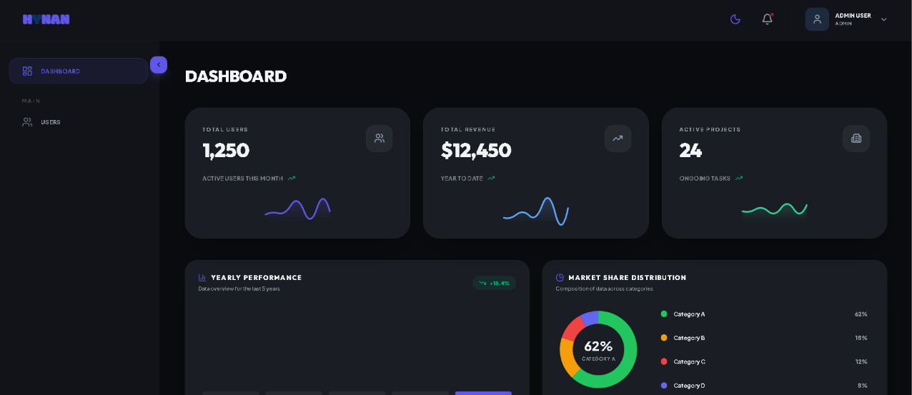

# Premium Admin Dashboard Boilerplate

A modern, clean, and professional Admin Dashboard boilerplate built with the latest web technologies. Designed for speed, scalability, and a premium user experience.

## Preview



## Features

- **Modern Tech Stack**: React 19, Vite 8, and TypeScript.
- **Tailwind CSS v4**: Utilizing the latest Tailwind features for high-performance styling.
- **Framer Motion**: Smooth, premium animations and transitions throughout the application.
- **Secure Auth**: Production-ready authentication flow using **Cookies** (`js-cookie`) for token persistence.
- **Modular Architecture**: Highly organized folder structure designed for easy scaling and maintenance.
- **Dark Mode**: Built-in dark/light mode with animated circular ripple transition and smooth icon swap.
- **Interactive UI**: Premium components including DataTables, Modals, Pagination, and dynamic Charts.
- **English-First**: Fully localized in English for a professional global standard.

## Tech Stack

- **Framework**: [React 19](https://react.dev/)
- **Build Tool**: [Vite 8](https://vitejs.dev/)
- **State Management**: [Zustand](https://zustand.docs.pmnd.rs/)
- **Styling**: [Tailwind CSS v4](https://tailwindcss.com/)
- **Animations**: [Framer Motion](https://www.framer.com/motion/)
- **Icons**: [Lucide React](https://lucide.dev/)
- **Routing**: [React Router 7](https://reactrouter.com/)
- **Linter & Formatter**: Oxlint & Prettier
- **Git Hooks**: Lefthook

## Project Structure

```text
src/
├── assets/             # Images, logos, and global assets
├── components/         # Global reusable UI components
│   ├── common/         # Layout-independent components
│   ├── layout/         # Header, Sidebar, Wrapper
│   └── ui/             # Core UI library (Buttons, Inputs, Tables)
├── core/               # Core logic (API services, global config)
├── hooks/              # Global custom React hooks
├── modules/            # Feature-based modules (Modular design)
│   ├── auth/           # Login, Forgot Password, Services
│   ├── dashboard/      # Main stats, Charts
│   └── users/          # User Management CRUD
├── routes/             # App routing configuration
├── stores/             # Zustand global state stores (Theme, Auth, Sidebar)
├── App.tsx             # Main entry & Root Layout
└── index.css           # Global styles & Tailwind 4 setup
```

## Getting Started

### 1. Prerequisites

- [Bun](https://bun.sh/) (v1.0+ recommended)

### 2. Installation

```bash
# Clone the repository
git clone https://github.com/your-username/admin-boilerplate.git

# Enter the directory
cd admin-boilerplate

# Install dependencies
bun install
```

### 3. Development

```bash
# Start dev server
bun run dev
```

### 4. Code Quality & Hooks

```bash
# Run ultra-fast linting with Oxlint
bun run lint

# Format code with Prettier
bun run format

# Check formatting
bun run format:check

# Type check
bun run type-check

# Run Lefthook pre-push manually
bunx lefthook run pre-push
```

### 5. Build

```bash
# Build for production
bun run build

# Preview production build
bun run preview
```

## Usage Guidelines

- **Adding new features**: Create a new folder in `src/modules/` following the existing patterns.
- **Theming**: Edit design tokens in `src/index.css` to customize the primary colors and design system.
- **API Integration**: Update `src/core/config/api.config.ts` with your backend URL.

## License

Distributed under the MIT License. See `LICENSE` for more information.

---

Built with ❤️ for rapid development.
